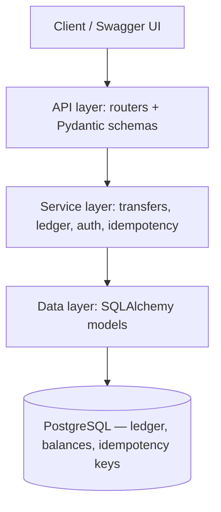
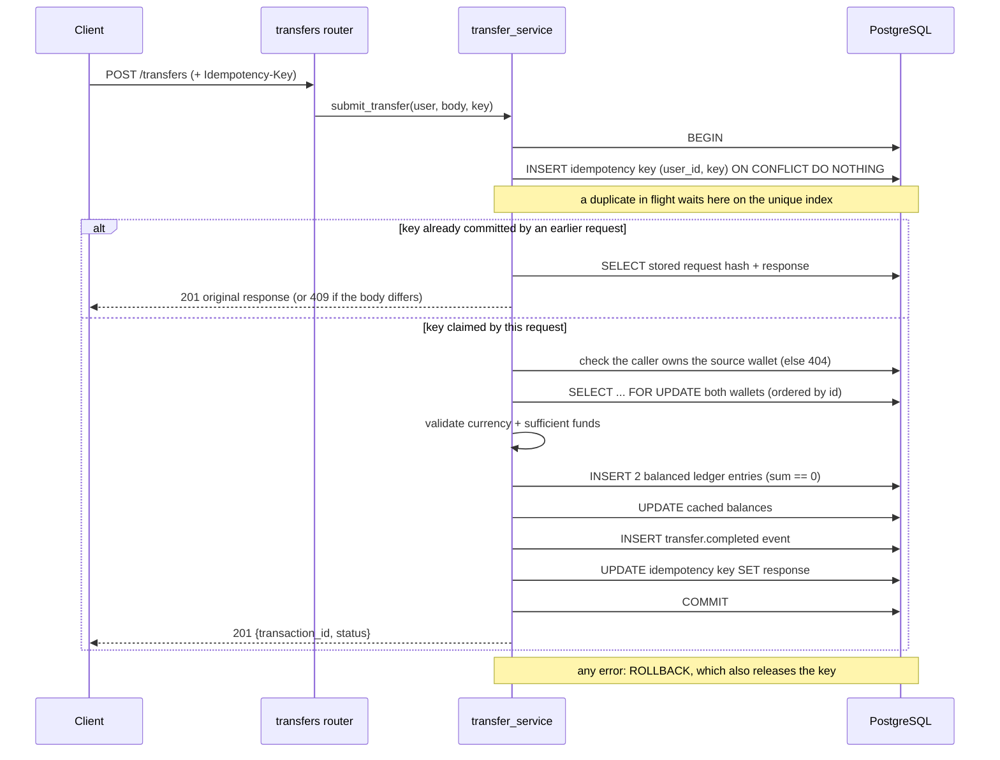

# PayLedger Architecture

PayLedger is a single FastAPI service organised into layers so business logic is
testable without HTTP or, where practical, without a real database.

## Layers

PostgreSQL is the only datastore. Idempotency keys are rows in the same database, so
they commit atomically with the transfer they protect. There is no rate limiting yet.

- **API layer** (`app/routers`, `app/schemas`) — request validation, auth dependencies,
  HTTP status and the structured error shape. No business rules.
- **Service layer** (`app/services`) — the rules: row-locked transfers, the double-entry
  invariant, deposits, idempotency, event emission. Pure-ish, framework-free.
- **Data layer** (`app/models`, `app/db`) — SQLAlchemy 2 models + session; schema managed
  by Alembic migrations.

## Transfer sequence (the core)

Everything after `BEGIN` happens in **one** database transaction: the
idempotency key, the ledger entries, the balances, the event and the stored response
commit together or roll back together.

## Correctness guarantees

- **Money is integer minor units** — no floating-point rounding errors.
- **Double-entry, append-only** — every transaction's signed entries sum to zero;
  entries are never updated or deleted (corrections are compensating entries). Both are
  enforced in application code: `assert_balanced` runs before entries are inserted, and
  no code path updates or deletes them. The database has no constraint or trigger for
  either rule yet (a deferred constraint trigger summing entries per transaction would
  be the next step).
- **Race safety** — concurrent transfers on a wallet are serialised by
  `SELECT ... FOR UPDATE`, with wallets locked in id order to avoid deadlocks. The locked
  read always refreshes the row (`populate_existing`), so a wallet object loaded earlier
  in the session can never supply a stale balance. Proven by
  `tests/integration/test_concurrent_transfers.py`.
- **Idempotency** — repeating `POST /transfers` with the same `Idempotency-Key` returns the
  original response instead of executing twice, including when the retries arrive in
  parallel: PostgreSQL makes the second `INSERT` of a key wait for the first
  transaction, then either replay its committed response or, if it rolled back, run
  itself. Keys are scoped per user. Proven by
  `tests/integration/test_concurrent_idempotency.py`.
- **Ownership** — the caller must own the source wallet of a transfer, and can only read
  their own accounts, wallets, statements and transactions (a transaction is theirs if it
  touches one of their wallets). Anything else is a 404 identical to a missing id.
