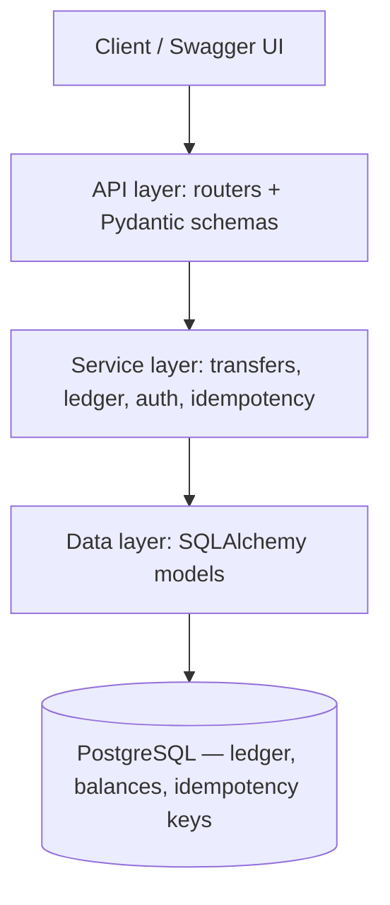
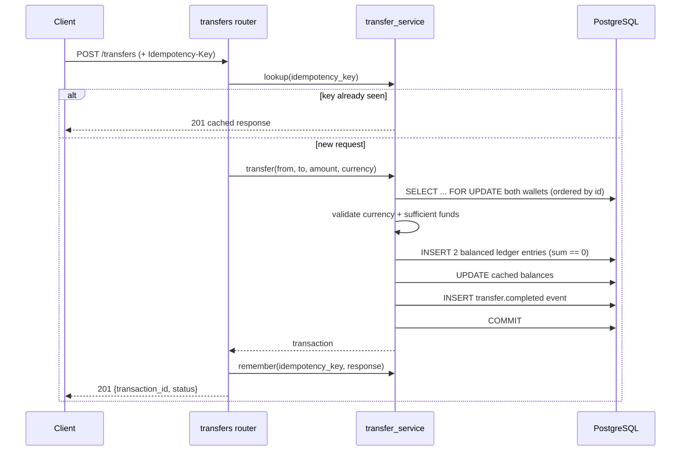

# PayLedger Architecture

PayLedger is a single FastAPI service organised into layers so business logic is
testable without HTTP or, where practical, without a real database.

## Layers

PostgreSQL is the only datastore. Idempotency keys are rows in the same database, so
they commit atomically with the transfer they protect. There is no rate limiting yet.

- **API layer** (`app/routers`, `app/schemas`) — request validation, auth dependencies,
  HTTP status and the structured error shape. No business rules.
- **Service layer** (`app/services`) — the rules: row-locked transfers, the double-entry
  invariant, deposits, idempotency, event emission. Pure-ish, framework-free.
- **Data layer** (`app/models`, `app/db`) — SQLAlchemy 2 models + session; schema managed
  by Alembic migrations.

## Transfer sequence (the core)

## Correctness guarantees

- **Money is integer minor units** — no floating-point rounding errors.
- **Double-entry, append-only** — every transaction's signed entries sum to zero;
  entries are never updated or deleted (corrections are compensating entries).
- **Race safety** — concurrent transfers on a wallet are serialised by
  `SELECT ... FOR UPDATE`, with wallets locked in id order to avoid deadlocks. Proven by
  `tests/integration/test_concurrent_transfers.py`.
- **Idempotency** — repeating a write with the same `Idempotency-Key` returns the original
  response instead of executing twice.
